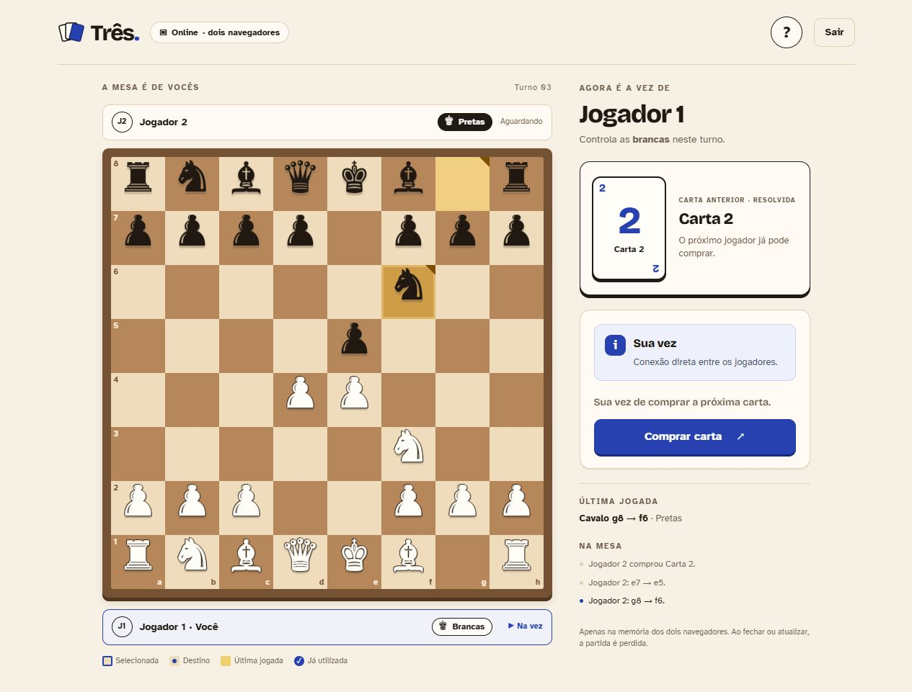

# Três

**Xadrez nos movimentos. Cartas a cada turno.**

Três é um jogo para duas pessoas que mistura peças de xadrez com cartas inspiradas em UNO. A cada turno, uma carta muda suas possibilidades: mover peças, colocar reforços no tabuleiro ou até trocar de lado com o adversário.

O objetivo é simples: **capture o rei da cor que seu adversário controla para vencer.**

## Quero jogar

### [Abrir o Três e jogar](https://luisgabrielmr.github.io/Tres/)

É gratuito para jogar. Você não precisa instalar nada, criar uma conta ou saber programação. Basta abrir o link no navegador.



### Duas pessoas no mesmo computador ou celular

1. Abra o jogo pelo link acima.
2. Escolha **Jogar localmente**.
3. Alternem as jogadas no mesmo aparelho. A tela mostra de quem é a vez.

### Cada pessoa no seu aparelho

1. Uma pessoa abre o jogo e escolhe **Criar partida**.
2. Ela clica em **Copiar convite** e envia o link ao amigo. Também pode compartilhar o código de oito caracteres exibido na tela.
3. O amigo abre o convite e clica em **Entrar em partida**. Se recebeu apenas o código, pode abrir o site, escolher **Entrar em partida** e digitá-lo.
4. Quando os dois se conectarem, a partida começa.

**Mantenham as duas páginas abertas.** O convite de uma sala vazia expira após dez minutos; nesse caso, basta criar outra.

## Como jogar sua primeira partida

1. **Confira sua cor.** Você controla as peças brancas ou pretas indicadas ao lado do seu jogador. Essa cor pode mudar durante a partida!
2. **Compre uma carta quando chegar sua vez.** “Comprar” significa virar uma carta do baralho do jogo; não envolve dinheiro.
3. **Siga o que a carta permite.** A tela mostra suas opções e quantos movimentos ainda restam.
4. **Mova as peças.** Clique na peça e depois em uma casa destacada, ou arraste a peça até o destino. No teclado, use as setas e Enter no tabuleiro.
5. **Capture o rei adversário para ganhar.** A partida termina imediatamente quando isso acontece.

Não conhece xadrez? Clique no botão **?** dentro do jogo. Ele explica como cada peça se move, as cartas e as regras especiais.

## O que cada carta faz?

| Carta | O que acontece |
| --- | --- |
| **1** | Faça um movimento. |
| **2** | Faça dois movimentos, usando duas peças diferentes. |
| **3** | Faça três movimentos, usando três peças diferentes. |
| **Bloqueio** | Você não move nenhuma peça e passa a vez. |
| **Reverse** | Os jogadores trocam as cores que controlam, e a vez passa ao outro jogador. As peças ficam onde estão. |
| **+2** | Escolha entre adicionar até dois peões **ou** fazer dois movimentos com peças diferentes. |
| **+4** | Escolha entre adicionar uma dama **ou** fazer quatro movimentos com peças diferentes. |

**A mesma peça só pode se mover uma vez por carta.** Por exemplo, com a carta 3, você pode mover um peão, um cavalo e um bispo, mas não pode mover a mesma dama três vezes.

Nas cartas +2 e +4, adicionar peças e mover são escolhas separadas: você não pode combinar as duas opções na mesma carta. Também pode ignorar a carta antes de escolher. Se optar por adicionar peões, pode colocar somente um e encerrar o efeito. Depois de escolher mover, deve usar os movimentos disponíveis, salvo se a partida terminar ou nenhuma peça puder mais jogar.

### Onde entram as peças extras?

O jogo destaca as casas permitidas. Só é possível adicionar uma peça em uma **casa vazia**, sem substituir outra.

| Peça adicionada | Se você controla brancas | Se você controla pretas |
| --- | --- | --- |
| Peões do **+2** | Segunda fileira: a2 até h2 | Sétima fileira: a7 até h7 |
| Dama do **+4** | Primeira fileira: a1 até h1 | Oitava fileira: a8 até h8 |

Se faltar espaço, você ainda pode escolher a opção de mover. As peças adicionadas funcionam como as demais; uma cor pode ter várias damas ou mais de oito peões.

### Entendendo o Reverse

Imagine que você controla as brancas e seu amigo controla as pretas. Após um **Reverse**, você passa a controlar as pretas e seu amigo fica com as brancas.

Nenhuma peça muda de casa ou de cor por causa da carta. O que muda é **quem controla cada lado**. Se você tirar +4 depois dessa troca, sua nova dama será preta e entrará em uma casa livre da oitava fileira.

## O que muda em relação ao xadrez?

- O tabuleiro começa na posição tradicional, e as peças mantêm seus movimentos de xadrez.
- **Não existe xeque-mate.** É preciso capturar o rei adversário. Seu rei pode ficar ameaçado, e isso não impede uma jogada.
- As cartas determinam quantos movimentos você faz ou qual efeito pode usar naquele turno.
- Há promoção de peões, roque e en passant. O botão **?** explica essas jogadas e suas adaptações ao Três.
- Não há empate por repetição, regra dos 50 movimentos ou afogamento. Se não houver movimentos possíveis com as peças ainda disponíveis naquele turno, a vez passa ao outro jogador.
- Tentar uma jogada inválida não gasta um movimento.

## Dúvidas comuns

### A partida fica salva?

Não. O jogo não guarda partidas nem histórico. **Sair, atualizar a página ou fechar a aba faz você perder a sessão.** O código do convite não serve para recuperar uma partida encerrada.

### Meu amigo precisa criar uma conta?

Não. Os dois só precisam abrir o site e usar o convite ou código da sala.

### A conexão falhou. O que faço?

Mantenham as duas páginas abertas, confiram a internet, atualizem o jogo e criem uma nova sala. Usem navegadores atualizados. Se o problema continuar, informem a mensagem exibida, os navegadores utilizados e se alguma janela está no modo anônimo.

O jogo tenta conectar os dois navegadores e pode usar um servidor intermediário quando necessário. Isso amplia as possibilidades de conexão, mas algumas redes ou configurações de navegador ainda podem impedir o acesso.

### Posso continuar depois que a internet cair?

Uma interrupção breve pode ser recuperada automaticamente em até 20 segundos, se a conexão ainda puder ser restabelecida. Se a partida for encerrada, será necessário começar outra.

---

## Para quem quer desenvolver ou contribuir

**Esta parte é opcional. Você não precisa seguir nenhuma destas instruções para jogar pelo site.**

<details>
<summary><strong>Ver instalação, comandos e documentação técnica</strong></summary>

### Executar no computador

O projeto usa React, TypeScript e Vite. Tenha Git, Node.js em uma versão compatível com o campo `engines` do [package.json](package.json) e npm disponíveis.

```sh
git clone https://github.com/luisgabrielMR/Tres.git
cd Tres
npm ci
npm run dev
```

Abra o endereço local informado no terminal. `npm ci` instala as dependências; `npm run dev` inicia o site para desenvolvimento.

| Comando | Para que serve |
| --- | --- |
| `npm test` | Executa os testes automatizados das regras e da comunicação entre jogadores. |
| `npm run build` | Verifica o TypeScript e prepara os arquivos do site na pasta `dist/`. |
| `npm run preview` | Abre uma prévia local dos arquivos gerados pelo build. |

O modo local não depende dos serviços de conexão online após carregar a página. As fontes são distribuídas junto com a aplicação.

### Organização do código

| Pasta | Responsabilidade |
| --- | --- |
| `src/core/chess` | Tabuleiro, peças e movimentos de xadrez. |
| `src/core/tres` | Cartas, turnos, controle das cores e regras do Três. |
| `src/application` | Coordenação das partidas local e online. |
| `src/multiplayer` | Conexão, validação das mensagens e verificação de sincronização. |
| `src/ui` | Telas, tabuleiro, cartas, animações e interações. |
| `tests` | Testes automatizados e páginas de diagnóstico usadas no desenvolvimento. |

As regras não dependem dos componentes React e podem ser testadas sem abrir o navegador. O baralho é configurado em [src/core/tres/deck.ts](src/core/tres/deck.ts). Os dois jogadores usam a mesma sequência determinística de cartas.

No roque, rei e torre contam como peças utilizadas na carta, embora a jogada consuma apenas um movimento. A promoção mantém a identidade da peça e não permite movê-la de novo na mesma carta. A oportunidade de en passant termina no próximo movimento, na compra de carta especial ou no encerramento do turno por ausência de movimentos.

### Conexão online e publicação

O site público usa GitHub Pages. PeerJS Cloud ajuda os navegadores a se encontrarem; as ações da partida trafegam pelo WebRTC DataChannel. O TURN do Metered permite retransmitir os dados quando a conexão direta não é possível. Não há conta de jogador, banco de partidas, ranking, chat ou analytics implementados pelo jogo.

Em uma instalação nova, sem configuração adicional, há somente STUN. Para habilitar TURN, configure `VITE_ICE_SERVERS_URL` conforme o [.env.example](.env.example) e o [guia de publicação](docs/deploy.md). A versão publicada já utiliza esse endpoint. Somente uma chave explicitamente publicável e limitada à credencial TURN pode entrar no frontend; nunca use a chave administrativa da conta.

A infraestrutura foi escolhida para custo inicial de R$ 0. Serviços gratuitos têm cotas e condições próprias; consulte o guia antes de configurar outra publicação. O jogo não salva partidas, mas os provedores podem manter seus próprios registros operacionais.

### Validação e documentos do projeto

Há 102 testes automatizados aprovados. A versão pública foi verificada em duas abas, e uma bancada separada confirmou troca de mensagens usando obrigatoriamente TURN nos dois lados. Isso não substitui a validação em diferentes aparelhos, navegadores e redes, que continua pendente.

- [Regras e arquitetura — Comitê 1](docs/comite-1.md).
- [Interface e modo local — Comitê 2](docs/comite-2.md).
- [Multiplayer, testes e auditoria — Comitê 3](docs/comite-3.md).
- [Publicação, TURN e serviços gratuitos](docs/deploy.md).
- [Mockup original](docs/mockup-original.html), preservado como referência histórica; pode mostrar regras anteriores.

O Comitê 1 foi aprovado e o Comitê 2 foi implementado a partir do mockup fornecido por Luis. O Comitê 3 tem o site publicado e o TURN validado, com as pendências de verificação descritas acima. As regras resumidas no início deste README incluem as alterações posteriores de +2/+4 e a proibição de repetir uma peça na mesma carta.

</details>
